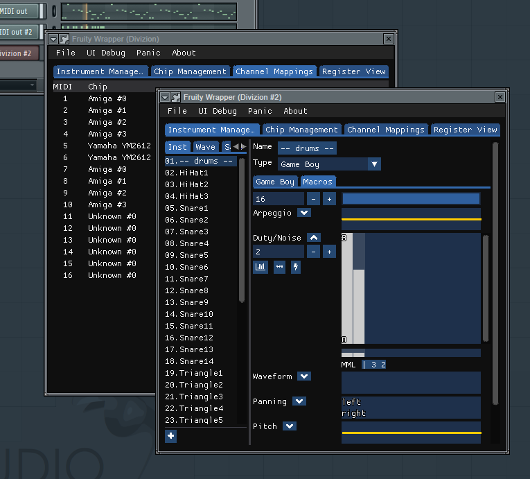

# Divizion

Take two of creating a plugin that most "serious" DAWs can load but doesn't load the entire Furnace app.

It's very messy. Barely any GUI. Default FM instrument only. But hey, there's something running.

And yes, the Vee Ess Tee is Windows-only.